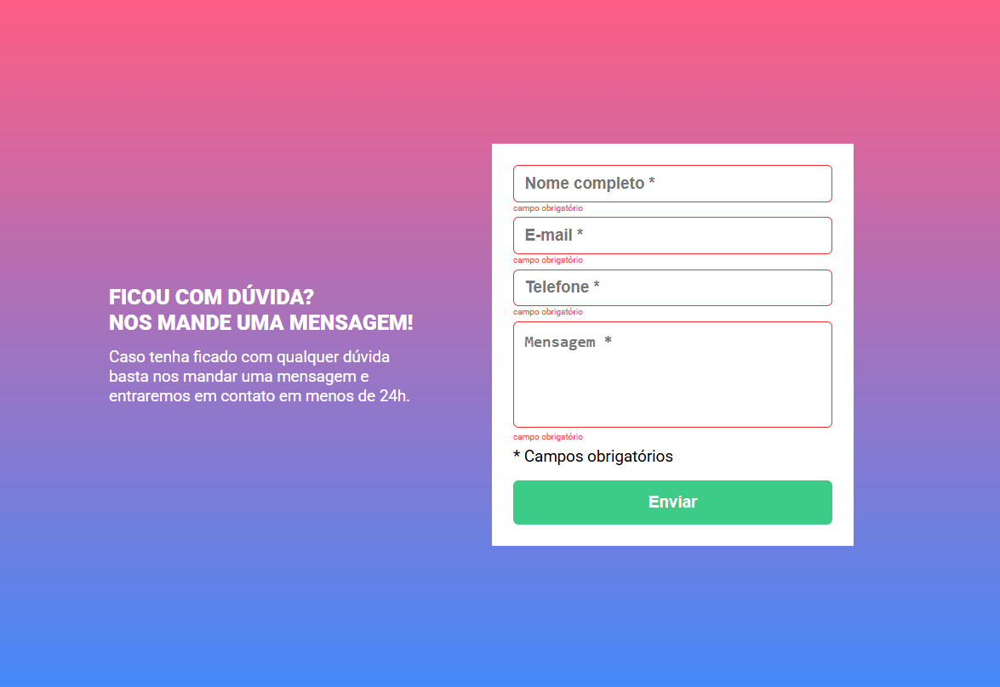

# Desafio do módulo de JavaScript intermediário do curso DevQuest

## Table of contents

- [Visão Geral](#visão-geral)
  - [O desafio](#o-desafio)
  - [Screenshot](#screenshot)
  - [Links](#links)
- [Meu Processo](#meu-processo)
  - [Construído com](#construido-com)
  - [O que aprendi](#o-que-aprendi)
  - [Recursos úteis](#recursos-uteis)
- [Autor](#autor)

## Visão Geral

### O desafio

O objetivo do desafio é recriar uma página proposta pelo curso.
Esta página deve conter um formulário, e o formulário deve ter uma validação nos campos onde se o campo estiver vazio, o mesmo deve ficar com uma borda vermelha, e deve ser exibida a mensagem "campo obrigatório" logo abaixo do campo. E se o campo estiver preenchido, ele deve ficar com as bordas verdes.

### Screenshot

### Links

- URL Solução: [https://github.com/EvandroBaraka/huddle-landing-page.git](https://github.com/EvandroBaraka/huddle-landing-page.git)
- URL Site: [https://evandrobaraka.github.io/huddle-landing-page/](https://evandrobaraka.github.io/huddle-landing-page/)

## Meu Processo

### Construído com:

- HTML5 Marcação Semântica
- Propriedades CSS
- Flexbox
- JavaScript

### O que aprendi

Botei em prática novos aprendizados referentes a eventos no JS, e também revi alguns conceitos de especificidade de seletores de CSS.

### Recursos úteis

- [Chat GPT](https://chat.openai.com/) - É uma grande ferramenta que me ajudou tirarando dúvidas quando ficava travado em algum problema.

## Autor

- Facebook - [Evandro Passaia](https://www.facebook.com/evandro.passaiaze)
- Frontend Mentor - [@EvandroBaraka](https://www.frontendmentor.io/profile/EvandroBaraka)
- Github - [@EvandroBaraka](https://github.com/EvandroBaraka)
- Linkedin - [Evandro Passaia](https://www.linkedin.com/in/evandro-passaia-62b9a5269/)